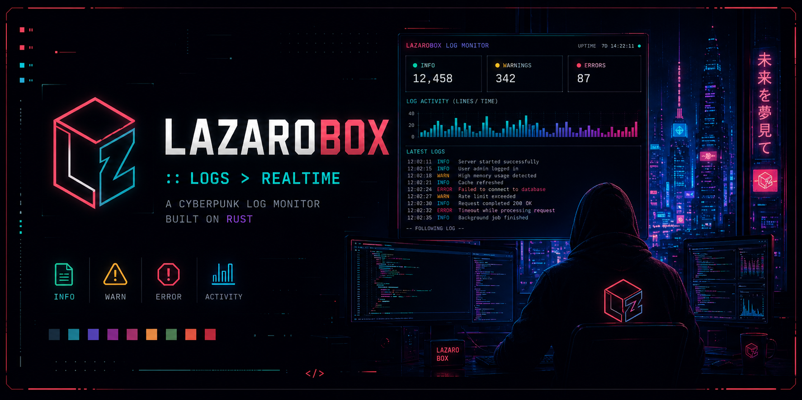

# LazaroBox Logs

> `[ LZBOX ] :: signal > noise` — Real-time server log analyzer built in Rust.

A terminal UI tool for monitoring web server logs in real time. Part of the [LazaroBox](https://github.com/pichu2707) ecosystem — designed to match the cyberpunk dark aesthetic of lazarobox-nvim and lazarobox-kitty.

---

## Features

- **SSH** — Real-time log streaming via `tail -f` over SSH (password or key-based auth)
- **SFTP** — Polling every 2s or 5s via SFTP
- **FTP** — Polling every 2s or 5s via FTP (port 21)
- **Local** — Watch a local file in real time (development mode)
- **Bot detection** — Tracks Googlebot, GPTBot, ClaudeBot, Bingbot, Semrush, Ahrefs and more
- **Activity sparkline** — Visual chart of requests over time
- **LazaroBox theme** — Cyberpunk dark palette (`#191E28` base, cyan/blue/purple accents)
- **Interactive TUI** — Menu, connection form, connecting screen, error screen

---

## Installation

```bash
git clone https://github.com/pichu2707/lazarobox-logs.git
cd lazarobox-logs
cargo build --release
./target/release/log-anayzer
```

### Dependencies

- Rust 1.70+
- `libssl-dev` (for SSH/SFTP support)

```bash
# Ubuntu / Debian
sudo apt install libssl-dev pkg-config

# Arch
sudo pacman -S openssl
```

---

## Usage

Run the binary and navigate the interactive menu:

```bash
cargo run
```

### Navigation

| Key | Action |
|-----|--------|
| `↑ ↓` | Navigate menu |
| `Enter` | Select / Connect |
| `Tab` | Next field in form |
| `Shift+Tab` | Previous field |
| `← →` | Toggle polling interval (SFTP/FTP) |
| `Esc` | Back to menu |
| `q` | Quit |

### Connection modes

**SSH** — Best for VPS/dedicated servers with SSH access:
```
IP:       your-server-ip
Port:     22
User:     root
Key:      ~/.ssh/id_ed25519   (or leave empty and use password)
Log path: /var/log/nginx/access.log
```

**FTP** — For shared hosting (cPanel, Nicalia, etc.):
```
IP:       your-server-ip
Port:     21
User:     your-ftp-user
Password: your-ftp-password
Log path: /home/user/access-logs/yourdomain.com
```

**Local** — For development and testing:
```
Log path: dummy.log
```

Then in another terminal, append lines to test:
```bash
echo '1.2.3.4 - - [15/Jun/2026:18:00:00 +0200] "GET / HTTP/1.1" 200 1234 "-" "Googlebot/2.1"' >> dummy.log
```

---

## Detected Bots

| Bot | Pattern |
|-----|---------|
| Googlebot | `googlebot` |
| GPTBot (OpenAI) | `gptbot` |
| ClaudeBot | `claudebot` |
| Bingbot | `bingbot` |
| Semrush | `semrushbot` |
| Ahrefs | `ahrefsbot` |
| DotBot | `dotbot` |
| MJ12bot | `mj12bot` |
| Bytespider (TikTok) | `bytespider` |
| PetalBot (Huawei) | `petalbot` |

---

## Project Structure

```
src/
├── main.rs           # App state, event loop, connector dispatch
├── models.rs         # Shared types: LogStats, ConnectionConfig, AppState
├── ui.rs             # Log viewer: metrics, sparkline, bot chart, log lines
├── ui_menu.rs        # Main menu with LazaroBox ASCII art
├── ui_form.rs        # Connection form with field focus
├── ui_connecting.rs  # Spinner screen while connecting
├── ui_error.rs       # Error screen
└── connector/
    ├── ssh.rs        # SSH connector (tail -f, key or password auth)
    ├── sftp.rs       # SFTP connector (polling)
    ├── ftp.rs        # FTP connector (polling)
    └── local.rs      # Local file connector (linemux)
```

---

## Color Palette

Built with the [LazaroBox](https://github.com/pichu2707/lazarobox-nvim) palette:

| Role | Color |
|------|-------|
| Background | `#191E28` |
| Surface | `#232A40` |
| Text | `#F3F6F9` |
| Cyan (accent) | `#00FFFF` |
| Blue | `#7FB4CA` |
| Green | `#B7CC85` |
| Yellow | `#FFE066` |
| Red | `#CB7C94` |
| Purple | `#B99BF2` |

---

## Part of the LazaroBox Ecosystem

| Tool | Repo |
|------|------|
| Neovim config | [lazarobox-nvim](https://github.com/pichu2707/lazarobox-nvim) |
| Kitty config | [lazarobox-kitty](https://github.com/pichu2707/lazarobox-kitty) |
| Log analyzer | [lazarobox-logs](https://github.com/pichu2707/lazarobox-logs) |

---

## Author

Built by Javi Lázaro — [javilazaro.es](https://www.javilazaro.es)

## License

MIT
